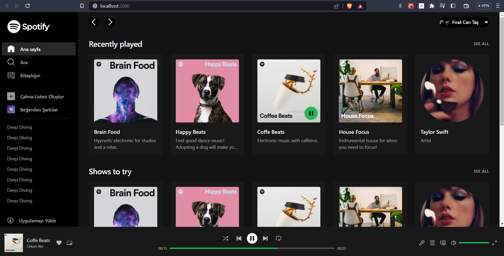

<br/>
<p align="center">
  <a href="https://open.spotify.com/intl-tr">
    
  </a>

  <h3 align="center">Spotify UI Demo</h3>


</p>


      

## Table Of Contents

* [About the Project](#about-the-project)
* [Built With](#built-with)
* [Getting Started](#getting-started)
  * [Prerequisites](#prerequisites)
  * [Installation](#installation)


## About The Project

This project was developed as a graduation project, which is the last stage of the SoftITo front end developer course, which is an establishment of the Istanbul Chamber of Commerce.

## Built With

While developing this project, there were some libraries that I used and some packages that I benefited from. These; I used React, Redux Toolkit, Tailwinds CSS, React-router, React-use, Headless UI, Indiana drag scroll and finally the "nekoCalc" website to convert the pixel units on the Spotify page to "rem" while working on Tailwind.

* [React](https://react.dev/)
* [Redux Toolkit](https://redux-toolkit.js.org/)
* [React-use](https://github.com/streamich/react-use)
* [Tailwind CSS](https://tailwindcss.com/)
* [Headless UI](https://headlessui.com/)
* [Indiana drag scroll](https://www.npmjs.com/package/react-indiana-drag-scroll)

## Getting Started

This is an example of how you may give instructions on setting up your project locally.
To get a local copy up and running follow these simple example steps.

### Prerequisites

This is an example of how to list things you need to use the software and how to install them.

* npm

```sh
npm install npm@latest -g
```

### Installation

1. Clone the repo

```sh
git clone https://github.com/FiratCanTas/Spotify-UI-Demo
```

3. Install NPM packages

```sh
npm install
```

4. Run the project

```
npm start
```

